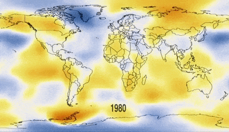

## ClimateChngLK 🌍

Category: Data Analysis, Visualization, Front End Web Development, UI/UX

Web dashboard on Climate Change's Impact on Sri Lanka and the world. Shows the trends of global warming, CO2 emissions over the decades and future trends. This analysis gives unique insights into the Industries that contribute most towards global warming, the countries with the highest rates of emission, the cumulative emission contribution towards global warming by top emitters and attempts to highlight the gravity of the current situation. 
Real time updated weather for key Sri Lankan cities show the current weather data for the visitor's time. Sri Lanka's greenhouse emission trends, fuel consumption, mean temperatures and impact of climate change for Sri Lanka are few of the analysis attempted to be done with this project.   

The action page details what are the best actions we could take to mitigate Climate Change based on the independent research done by me. The 'what's that?' page attempts to give an overview of what global warming is and is a 101 of what it entails. The data sources and the claims made after analysing these data are referred at the bottom of the page where available.  
To see all the data sources and resources used, please navigate to more page. 

**Tech Stack Used:**

> See analytics: [https://subhanu-dev.github.io/ClimateChngLK/analytics.html](https://subhanu-dev.github.io/ClimateChngLK/analytics.html) 
> Live at : [https://subhanu-dev.github.io/ClimateChngLK/index.html](https://subhanu-dev.github.io/ClimateChngLK/index.html)

> Dribbble design link: [climatechng-dribbble](https://dribbble.com/shots/25081509-ClimateChngLK-Website-Summarizing-Climate-Change-Metrics)

---
Made with ❤️ by [Subhanu](https://github.com/subhanu-dev)
